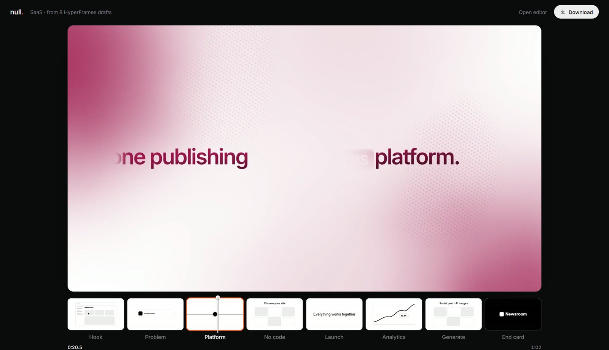
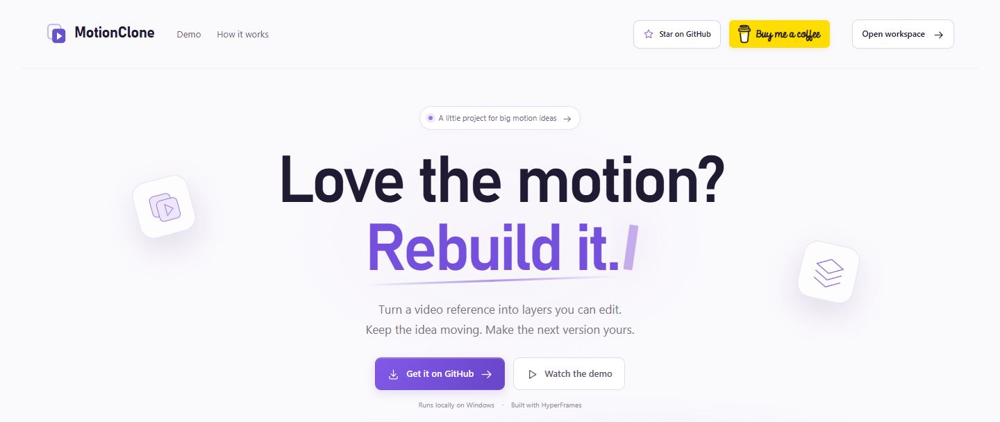

  

  <a href="mailto:kaihanwasely@gmail.com">kaihanwasely@gmail.com</a>
  &nbsp;&nbsp;·&nbsp;&nbsp;
  <a href="mailto:kaiguy432@gmail.com">kaiguy432@gmail.com</a>
  &nbsp;&nbsp;·&nbsp;&nbsp;
  <a href="https://x.com/waselyyy">X</a>
  &nbsp;&nbsp;·&nbsp;&nbsp;
  <a href="https://motionclone.lol">motionclone.lol</a>
  &nbsp;&nbsp;·&nbsp;&nbsp;
  <a href="https://buymeacoffee.com/blix">Buy me a coffee</a>

## Selected work

**[Null Motion](https://github.com/blixvip/NullMotion)** — A finished motion-graphics ad plays over the simple black-and-white HyperFrames drafts it grew from, in sync, with one-click MP4 export.

<table>
  <tr>
    <td width="50%" valign="top">
      
        
      <b><a href="https://github.com/blixvip/MotionClone">MotionClone</a></b> — Rebuild a reference video into an editable HyperFrames project with Codex and ChatGPT. Compare it, export a video, and keep the project. <a href="https://motionclone.lol">Online studio</a>.
    </td>
    <td width="50%" valign="top">
      
        
      <b><a href="https://github.com/blixvip/easyedit">easyedit</a></b> — Type a movie name and get a fan edit: the film's best speech in animated captions, then a montage cut to the beat. Local-first, no API keys. Works with Claude Code and Codex.
    </td>
  </tr>
</table>

## Other tools

<table>
  <tr>
    <td width="33%" valign="top">
      <b><a href="https://github.com/blixvip/ai-broadcaster">AI Broadcaster</a></b> 
      A Chrome extension that sends one prompt, image, or PDF to many AI chats and checks that each one received it.
    </td>
    <td width="33%" valign="top">
      <b><a href="https://github.com/blixvip/x-media">X Media</a></b> 
      A local workspace for public X videos, photos, GIFs, and tweets, plus Reddit memes. No API key.
    </td>
    <td width="33%" valign="top">
      <b><a href="https://github.com/blixvip/skills">Skills</a></b> 
      Agent skills for Codex and Claude Code, including motion graphics, thumbnails, and UI work.
    </td>
  </tr>
</table>

## On the bench

Private work still in progress: Watch Better, Script Gen, AI Usage, Extension Manager, and a Discord YouTuber tracker.
