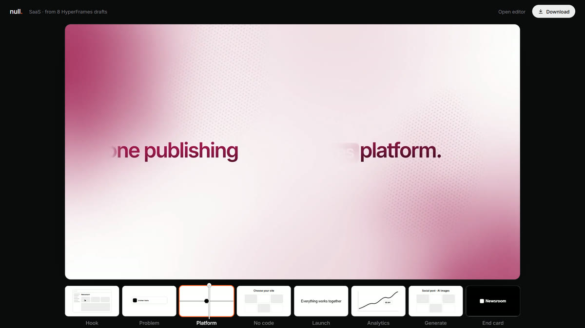
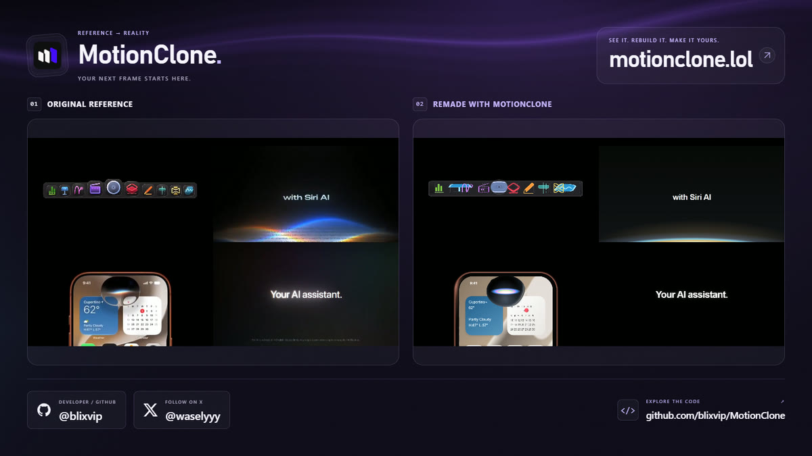
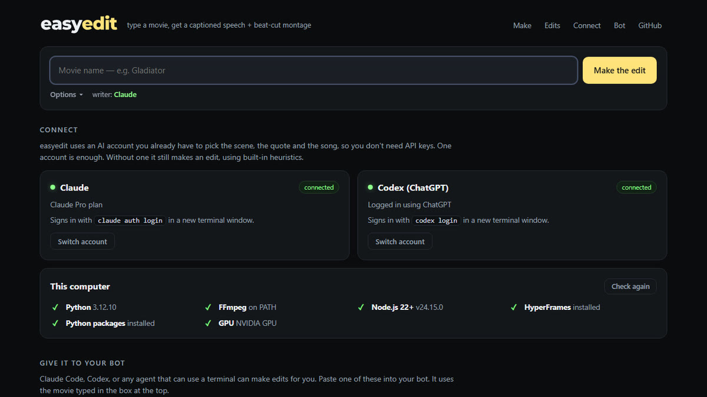
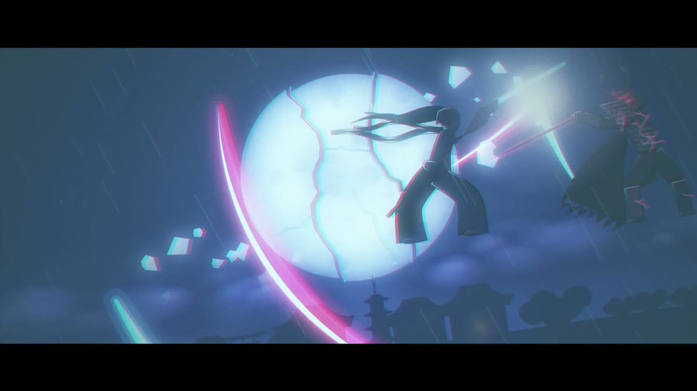
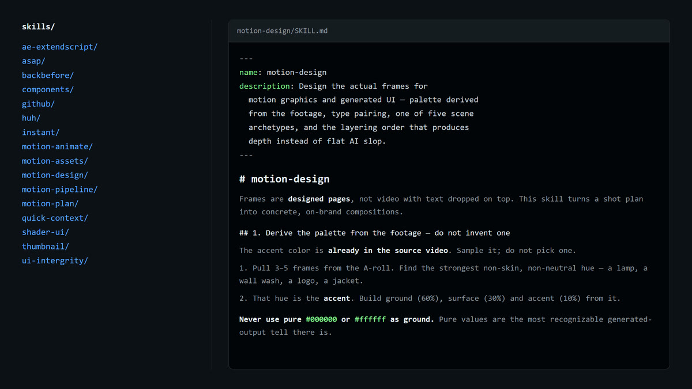
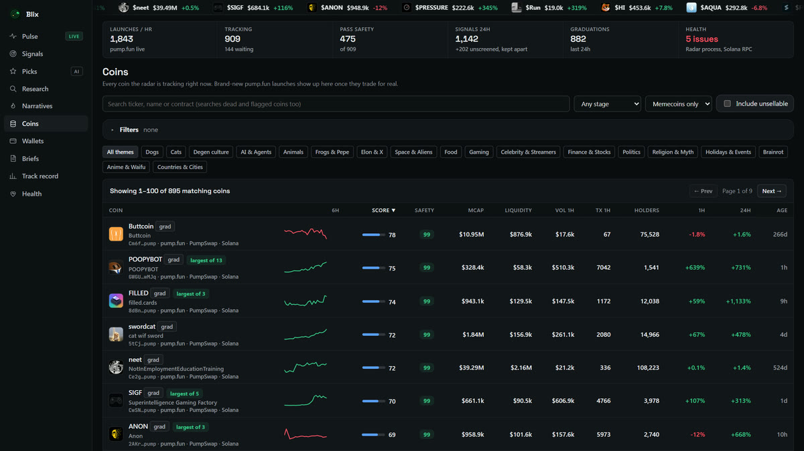

## Projects

<!-- projects:start -->

<table>
<tr>
<td width="50%" valign="top">

<h3><a href="https://github.com/blixvip/NullMotion">Null Motion</a></h3>

Plays a finished motion-graphics ad in sync with the rough HyperFrames drafts it grew from, so the work between them is visible. Exports the breakdown as one MP4.

★ 932 &nbsp;·&nbsp; <a href="https://www.nullmotion.com/">nullmotion.com</a>

</td>
<td width="50%" valign="top">

<h3><a href="https://github.com/blixvip/MotionClone">MotionClone</a></h3>

Point it at a reference video and it rebuilds the piece as an editable HyperFrames project, then plays the rebuild against the original so you can see where the timing drifts.

★ 358 &nbsp;·&nbsp; <a href="https://motionclone.lol">motionclone.lol</a>

</td>
</tr>
<tr>
<td width="50%" valign="top">

<h3><a href="https://github.com/blixvip/easyedit">easyedit</a></h3>

Type a movie name, get a fan edit: the film's best speech in animated captions, then a montage cut to the beat. Whisper for transcription, onset detection for the cuts.

★ 154 &nbsp;·&nbsp; <a href="https://blixvip.com/easyedit">blixvip.com/easyedit</a>

</td>
<td width="50%" valign="top">

<h3><a href="https://github.com/blixvip/html-anime">html-anime</a></h3>

Turns a scene prompt into a shot sheet, then has a coding agent draw the film in HTML and CSS. No video model — the frame above is code.

★ 17 &nbsp;·&nbsp; <a href="https://blixvip.github.io/html-anime/">blixvip.github.io/html-anime</a>

</td>
</tr>
<tr>
<td width="50%" valign="top">

<h3><a href="https://github.com/blixvip/skills">skills</a></h3>

The agent skills I use daily, as drop-in SKILL.md folders for Claude Code and Codex.

★ 4 &nbsp;·&nbsp; <a href="https://blixvip.com/skills">blixvip.com/skills</a>

</td>
<td width="50%" valign="top">

<h3><a href="https://github.com/blixvip/blixtrade">blixtrade</a></h3>

Solana memecoin terminal: live pump.fun feed, holder ledgers that separate snipers from bundles, real Jupiter quotes. Ships a public read API and an MCP server.

★ 2 &nbsp;·&nbsp; <a href="https://trade.blixvip.com/api">trade.blixvip.com/api</a>

</td>
</tr>
</table>

- **[X Media](https://github.com/blixvip/x-media)** — Browse public X media and tweets by username in a local Next.js app. No login, no API key.
- **[AI Broadcaster](https://github.com/blixvip/ai-broadcaster)** — Chrome extension that sends one prompt, image, or PDF to several AI chats at once and verifies each one received it.
- **[phonectl](https://github.com/blixvip/phonectl)** — Drives an Android phone from your computer over adb and scrcpy: browser dashboard, CLI, and a build → screenshot → verify loop for agents.

<!-- projects:end -->

---

## About

I'm Kaihan Wasely. I build local-first tools for video work — things that run on
your own machine, with no server to sign into, no API keys to paste, and no usage
meter. Where a tool needs a model, it borrows the Codex or Claude Code login you
already have rather than asking for a new one.

The constraint I keep coming back to is that a creative tool should work offline
and leave its output in a format you can edit by hand afterwards. So the video
projects compile to plain HTML and CSS instead of a binary timeline, the editors
write files you can open in a text editor, and nothing phones home. Mostly Python
and TypeScript, with ffmpeg doing the heavy lifting.

Based in Canada. Reachable at [kaiguy432@gmail.com](mailto:kaiguy432@gmail.com)
or [@waselyyy](https://x.com/waselyyy).

[motionclone.lol](https://motionclone.lol) ·
[nullmotion.com](https://www.nullmotion.com/) ·
[Discord](https://discord.gg/zEB4VjmfSb) ·
[Kick](https://kick.com/blixvip) ·
[Twitch](https://www.twitch.tv/blixvip)

The grid above is rebuilt daily by
[`scripts/build-readme.mjs`](scripts/build-readme.mjs) — it always shows the six
repositories with the most stars, in order.
